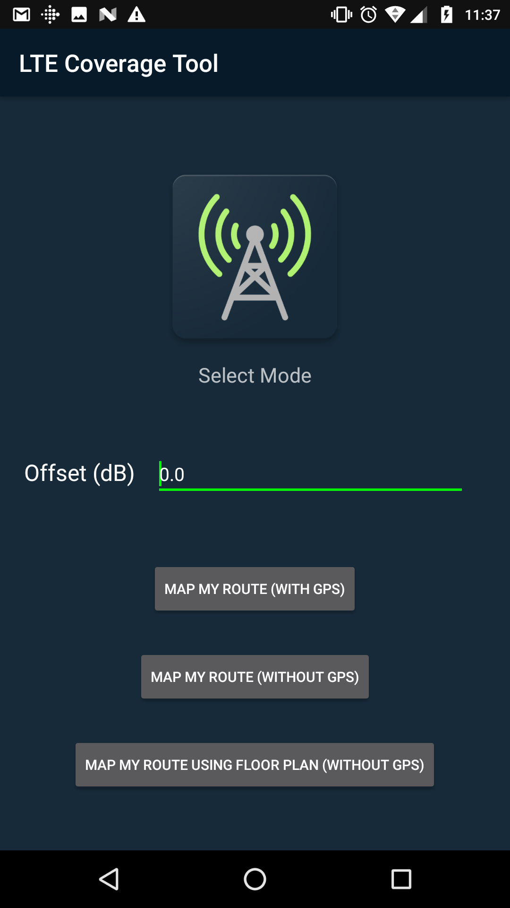
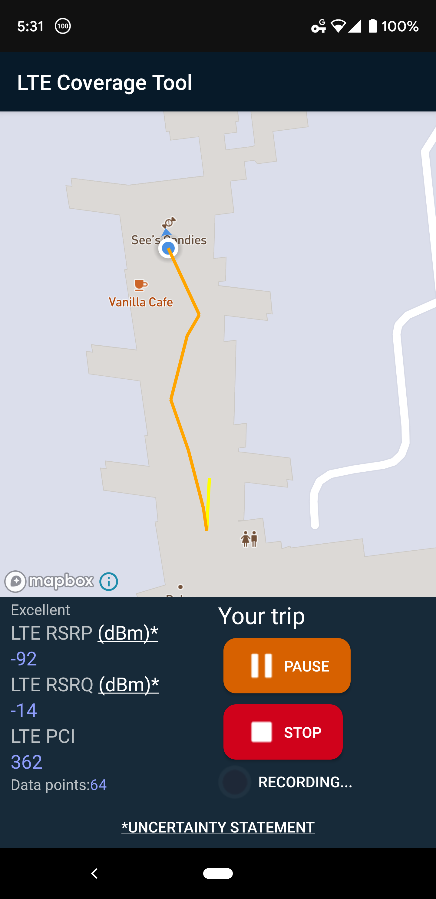
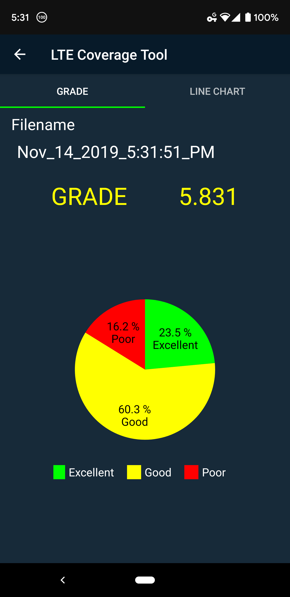
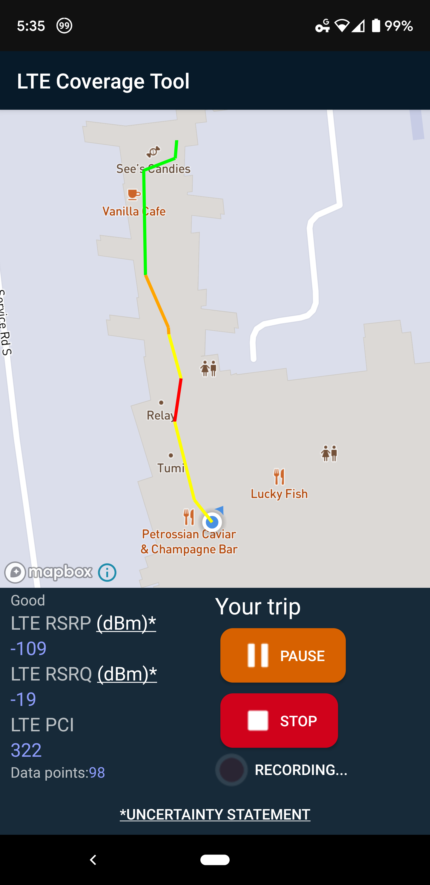
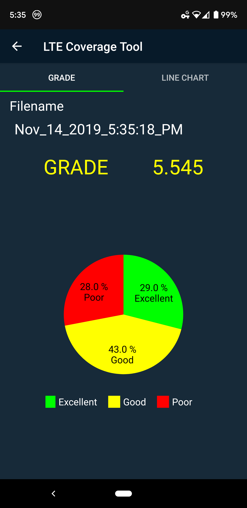
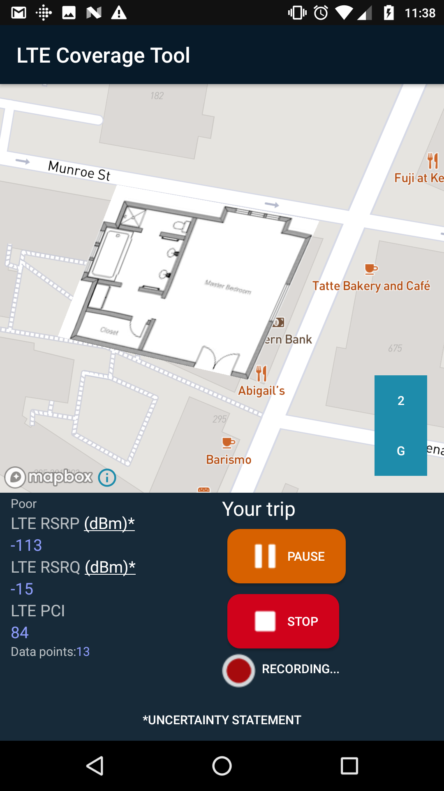

# Map my LTE
---

* LTE Coverage Tool extension
* Submitted going after techotoprotect challenge #4.

## 3 new map modes:
* Mode 1: Heat map using GPS allowing user to move and visualize LTE connectivity along the travelled route.
* Mode 2: Heat map without GPS (using localized network provider) to present data on a map.
* Mode 3: Heat map without GPS overlaid on an image or floor plan uploaded by a user. User can click where he she started and correct the route as needed.

### Running the app
* Install Android studio and import project via gradle
* Replace "testing_token" in strings.xml with your mapbox API key.
* Connect emulator with recommended API 19+ (for non-gps modes only). Recommend using physical and/or recent Android device for testing - such as a Google Pixel 3XL+
* Run project on device.

### TODO: Notes from 2/10
1. Mode 1 - First function wasn’t quite working as in the original. Was using a google pixel 2 to test.
2. Mode 2 - Using wifi data (was about a half mile off from correct values). Suggest combining with some other source to improve this. Not accurate enough currently. Couple the inertial sensors (IMU, etc.) to get a more accurate route.
3. Mode 3 - No movement logged yet. Need better interface for starting the first location before recording.
    1. Improve the multiple floor support and allow user to go between the floors. Allow overlaying the heat map.
    2. Store relative data to where you started to correct after your starting location. Applies to mode 2 as well where this is no initial GPS location.

### Demo video

https://youtu.be/f2X6bt_zFR4

### Screenshots

    

    

    

    

    

    

### ACKNOWLEDGEMENT NOTICE
This software was developed with funds from the Department of Homeland Security’s Science and Technology Directorate.

THE SOFTWARE IS PROVIDED 'AS IS' WITHOUT ANY WARRANTY OF ANY KIND, EITHER EXPRESSED, IMPLIED, OR STATUTORY, INCLUDING, BUT NOT LIMITED TO, ANY WARRANTY THAT THE SOFTWARE WILL CONFORM TO SPECIFICATIONS, ANY IMPLIED WARRANTIES OF MERCHANTABILITY, FITNESS FOR A PARTICULAR PURPOSE, AND FREEDOM FROM INFRINGEMENT, AND ANY WARRANTY THAT THE DOCUMENTATION WILL CONFORM TO THE SOFTWARE, OR ANY WARRANTY THAT THE SOFTWARE WILL BE ERROR FREE.  IN NO EVENT SHALL NIST BE LIABLE FOR ANY DAMAGES, INCLUDING, BUT NOT LIMITED TO, DIRECT, INDIRECT, SPECIAL OR CONSEQUENTIAL DAMAGES, ARISING OUT OF, RESULTING FROM, OR IN ANY WAY CONNECTED WITH THIS SOFTWARE, WHETHER OR NOT BASED UPON WARRANTY, CONTRACT, TORT, OR OTHERWISE, WHETHER OR NOT INJURY WAS SUSTAINED BY PERSONS OR PROPERTY OR OTHERWISE, AND WHETHER OR NOT LOSS WAS SUSTAINED FROM, OR AROSE OUT OF THE RESULTS OF, OR USE OF, THE SOFTWARE OR SERVICES PROVIDED HEREUNDER.

### Uncertainty Statement
Values are assumed to be accurate within ±8 dB for RSRP or ±3.5 dB for RSRQ, for a UE complying with 3GPP standard TR36.133 sections 9.1.2, 9.1.3, 9.1.5 and 9.1.6, operating under the following conditions:

1. Cell specific reference signals are transmitted either from one, two or four antenna ports.
2. Conditions defined in 36.101 Clause 7.3 for reference sensitivity are fulfilled.
3. RSRP|dBm according to Annex B.3.1 or B.3.3, as appropriate, for a corresponding Band.
4. Normal condition, as defined by 3GPP.
